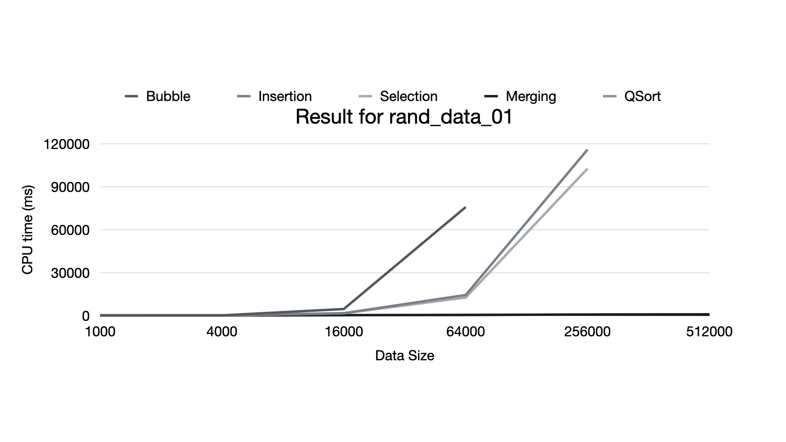
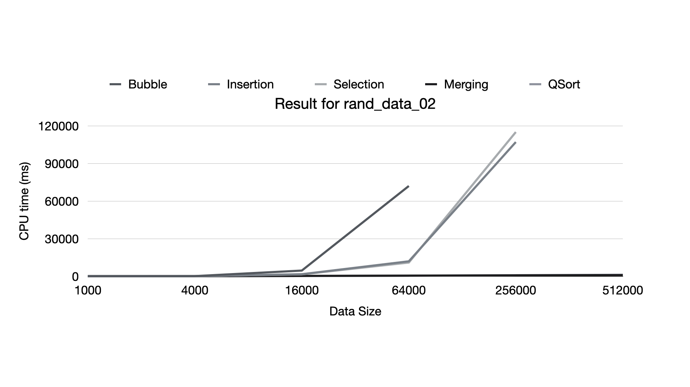
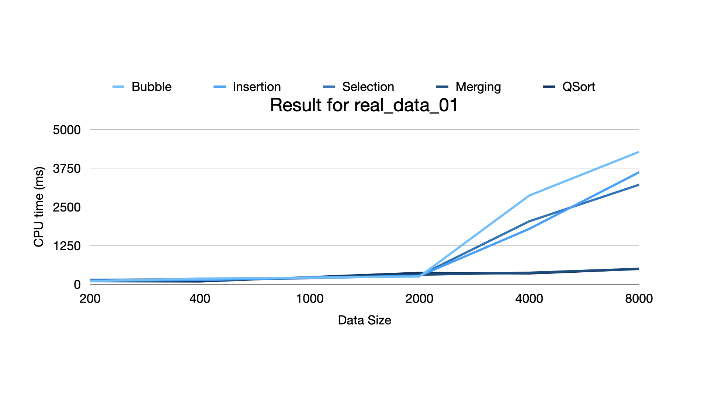
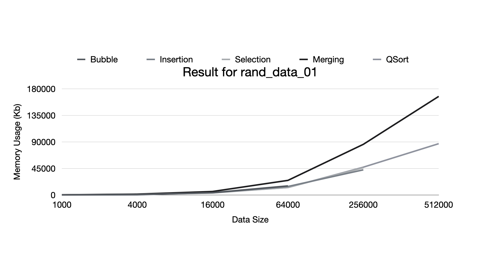
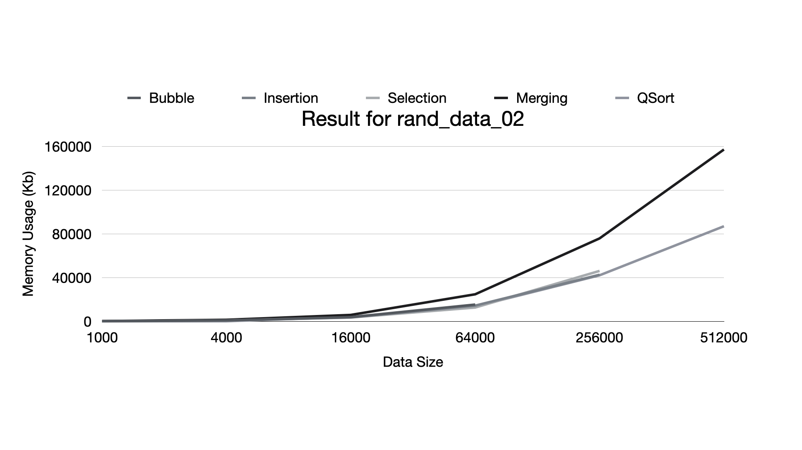
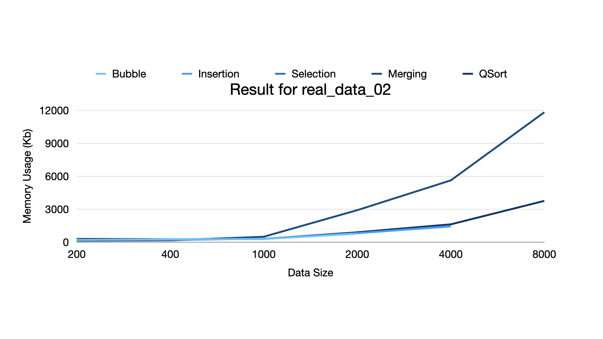

# Sort Algorithm Comparison

Minzhi Qu, University of Washington
Contact: quminzhi@gmail.com

## Sort Algorithm

In the first part, we will discuss basic idea and implementation of common sort algorithms.

### Bubble Sort

Bubble sort, also known as sinking sort, is a simple sort algorithm. The basic idea is to step through the list, compare adjacent elements and swaps them is they are in wrong order.

```c++
void bubbleSort(int* numbers, int size) {
    int i = 0;
    for (; i < size; i++) {
        int j = i + 1;
        for (; j < size; j++) {
            if (numbers[i] > numbers[j]) {
                int tmp = numbers[i];
                numbers[i] = numbers[j];
                numbers[j] = tmp;
            }
        }
    }
}
```

Clearly, time complexity for bubble sort is O(N^2).

### Selection Sort

The idea of selection sort is to repeatedly swap smallest unplaced value to front.

```bash
ex>   8  2  5  7  1  4  10
      |----unordered-----|

1st:  1  2  5  7  8  4  10
      ^  |---unordered---|

      ...

3rd:  1  2  4  7  8  5  10
      ^  ^  ^  |---------| 
```

The implementation in C is as follow.

```c
void selectionSort(int* numbers, int size) {
    int i = 0;
    for (; i < size; i++) {
        int min = i;
        int j = i + 1;
        for (; j < size; j++) {
            if (numbers[j] < numbers[min]) {
                min = j;
            }
        }
        // TODO: swap smallest value to proper place
        if (min != i) {
            int tmp = numbers[i];
            numbers[i] = numbers[min];
            numbers[min] = tmp;
        }
    }
}
```

Time complexity is O(N^2) and space complexity is O(1) for exchange.

### Insertion Sort

The basic idea of insertion sort is to insert number from unsorted list into sorted list.

```bash
ex>   8  2  5  7  1  4  10
      |----unordered-----|

1st:  8  2  5  7  1  4  10  # insert 8
      ^  |---unordered---|

      ...

3rd:  2  5  8  7  1  4  10  # insert 5 between 2 and 8 
      ^  ^  ^  |---------| 
```

The major overhead here is insert operation which requires to move elements in sorted list.

```c++
void insertionSort(int* numbers, int size) {
    int i = 1; // the first element do not have to move
    for (; i < size; i++) {
        int tmp = numbers[i];
        // TODO: slide elements in sorted list right to make room for numbers[i]
        int j = i;
        while (j >= 1 && numbers[j-1] > tmp) {
            numbers[j] = numbers[j-1];
            j--;
        }
        numbers[j] = tmp;
    }
}
```

Time complexity is O(N^2) and space complexity is O(1).

### Merge Sort

Merge sort is a classic divide and conquer algorithm, which repeatedly divides the data in half, sorts each half, and combines sorted halves into a sorted whole.

The algorithm is as follows:

- divide the list into two roughly equal halves.
- sort the left half.
- sort the right half.
- merge the two sorted halves into one sorted list, whose runtime is roughly O(N).

So the time complexity of merge sort is O(NlogN) and extra space O(N).

```c++
void merge(int* result, int size, int* left, int lsize, int* right, int rsize) {
    int l = 0;
    int r = 0;
    int i = 0;
    for (; i < lsize + rsize; i++) {
        if ((r >= rsize) || 
            ((l < lsize) && (left[l] <= right[r]))) {
            result[i] = left[l++];
        }
        else {
            result[i] = right[r++];
        }
    }
}

void mergeSort(int* result, int size) {
    if (size >= 2) {
        // TODO: split array in half
        int lsize = size / 2;
        int* left = malloc(sizeof(int) * lsize);
        memcpy(left, result, sizeof(int) * lsize);
        int rsize = size - lsize;
        int* right = malloc(sizeof(int) * rsize);
        memcpy(left, result + sizeof(int) * lsize, sizeof(int) * rsize);

        // TODO: sort halves
        mergeSort(left, lsize);
        mergeSort(right, rsize);

        // TODO: merge into result
        merge(result, size, left, lsize, right, rsize);

        // TODO: free dynamic memory
        free(left);
        free(right);
    }
}
```

### Quick Sort

Quick sort is another divide and conquer algorithm. The basic idea is to order a list by partitioning the list around a pivot element, then sorting each partition.

Its basic algorithm:

- choose one element in the list to be the pivot.
- divide the elements so that all elements less than the pivot are to its left and all greaters (or equal) are to its right.
- conquer by applying quick sort to both sides recursively.

The average time complexity is O(NlogN).

```c++
void quickSort(int* result, int first, int last) {
    int i, j, pivot, tmp;

    if (first < last) {
        // TODO: move all numbers greater than pivot to the right, and the smaller to the left.
        pivot = first; // random is better here
        i = first;
        j = last;
        while (i < j) {
            while ((result[i] < result[pivot]) && (i < last)) i++;
            while ((result[j] >= result[pivot] && (j > first)) j--;
            if (i < j) {
                tmp = result[i];
                result[i] = result[j];
                result[j] = tmp;
            }
        }
        
        // TODO: exchange pivot and j
        tmp = result[pivot];
        result[pivot] = result[j];
        result[j] = tmp;
        quickSort(result, first, j-1);
        quickSort(result, j+1, last);
    }
}
```

## Comparison

### Data

We got four sets of data for comparison tests.

- `random_data_01`: is generated with C builtin function `rand()`, ranging from 1 to 10000, and 1000000 numbers in total.
- `random_data_02`: is produced in C builtin function `rand()`, ranging from 1 to 1000000, and 1000000 numbers in total.
- `real_data_01`: is extracted from `popular` column of [Top 10000 Popular Movie Dataset](https://www.kaggle.com/omkarborikar/top-10000-popular-movies), containing 10000 numbers in total ranging from 100 to 1000.
- `read_data_02`: is extracted from `vote_count` column of [Top 10000 Popular Movie Dataset](https://www.kaggle.com/omkarborikar/top-10000-popular-movies), including 10000 numbers in total ranging from 100 to 100000.


### Metric

#### Measure of Disorder

`Disorder degree` is a way to measure how disorder a set of data is, which is defined as `N^(<N)` to `R`, where `N^(<N)` is the collection of all finite sequence of distinct nonnegative integers. This is defined in the work of [Estivill-Castro and Wood](http://citeseerx.ist.psu.edu/viewdoc/summary?doi=10.1.1.45.8017)

> Disorder = # of unordered pairs

#### Runtime

In our experiment, `run time` refers to CPU running time for a specific task, which is measured with linux command `time`. Experiment machine is Macbook Pro 2020 with

- CPU: 2 GHz Quad-Core Intel Core i5
- Memory: 16 GB 3733 MHz LPDDR4X

### Result

Our performance measures include `run time` and `memory usage`, and two parameters for dataset are `disorder` and `data size`.

- How to generate results? use provided shell-script `csort.sh`.

```bash
# csort.sh is provided for generating testing result
$ ./csort.sh
The script is used to test the performance of different sorting algorithms.
Please input executable file: 
Please input dataset:
test for bubble sort: running...
test for bubble sort: done.
test for insertion sort: running...
...
```

#### CPU Time

Unit: million seconds(ms)

- `rand_data_01`


Data Size | Bubble | Insertion | Selection | Merging | QSort 
---|---|---|---|---|---|---
1000 | 257 | 240 | 251 | 241 | 221 
4000 | 297 | 235 | 276 | 245 | 262 
16000 | 4739 | 1821 | 1729 | 472 | 389 
64000 | 75912 | 14523 | 12780 | 601 | 562 
256000 | NaN | 116104 | 102837| 873 | 902 
512000 | NaN | NaN | NaN | 1021 | 986 


- `rand_data_02`


Data Size | Bubble | Insertion | Selection | Merging | QSort |
---|---|---|---|---|---|---
1000 | 241 | 224 | 257 | 240 | 221
4000 | 258 | 231 | 281 | 237 | 262
16000 | 3781 | 2071 | 1919 | 422 | 403 
64000 | 72187 | 12119 | 11132 | 671 | 672 
256000 | NaN | 107215 | 115201 | 899 | 1028 
512000 | NaN | NaN | NaN | 1073 | 1417 


- `real_data_01`


Data Size | Bubble | Insertion | Selection | Merging | QSort
---|---|---|---|---|---|---
 200 | 103 | 121 | 117 | 143 | 102 
 400 | 187 | 138 | 155 | 168 | 94 
 1000 | 216 | 221 | 197 | 216 | 232 
 2000 | 253 | 272 | 284 | 311 | 371 
 4000 | 2871 | 1793 | 2038 | 376 | 352 
 8000 | 4281 | 3621 | 3219 | 504 | 497 


- `real_data_02`


 Data Size | Bubble | Insertion | Selection | Merging | QSort 
---|---|---|---|---|---|---
 200 | 114 | 122 | 109 | 123 | 97 
 400 | 162 | 131 | 125 | 118 | 112 
 1000 | 291 | 301 | 197 | 215 | 249 
 2000 | 384 | 291 | 284 | 319 | 361 
 4000 | 3721 | 2034 | 1978 | 356 | 384 
 8000 | 5313 | 3439 | 3122 | 487 | 528 







#### Memory Usage








### Conclusion

From the results above, we concludes that:

 Algorithm | Average Case | Worst Case | Advantage | Disadvantage 
 --- | --- | --- | --- | ---
Bubble | O(N^2) | O(N^2) | straightforward, simple, and stable | slow and inefficient on large data 
 Selection | O(N^2) | O(N^2) | better than bubble, stable | quite slow for large data 
 Insertion | O(N^2) | O(N^2) | efficient for small lists and low disordered data | sort big array slowly 
 Merging | O(NlogN) | O(NlogN) | great for large list and stable | extra memory 
 QSort | O(NlogN) | O(N^2) | great for large list and quite stable | bad for low disordered data 


